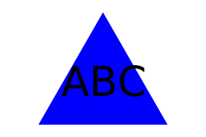

# OOP SVG Logo Maker

## Description
This project is a command-line application built using JavaScript, JSON, node.js, Inquirer, and FS. Jest was used for conducting tests. Users enter the text (up to 3 characters) and the text color. Then they choose the shape (circle, triangle, or square) and color of their logo. The logo is generated and saved as an SVG file. 

## Usage
In order to use this application, you must have node.js installed on your machine. You will also need a package.json with the required dependencies. Before installing dependencies, run "npm init" to create a package.json file. Also before installing npm dependencies, make sure you have a .gitignore file that includes node_modules/ and .DS_Store/. After running npm init, then run "npm i to install dependencies. Inquirer is what allows you to execute the prompts. If you want to run tests, make sure you have Jest installed.

To initialize the SVG Logo Maker, type "node index.js" in the command line. Answer the prompts and then view your new logo.svg. 

The images below shows example SVG logos that were created using the SVG Logo Maker.

## Installation
1. Clone the repository to your machine
2. Copy the files to your own repository
3. Conduct the git add, commit, and push commands to update your repository with the copied files
4. Follow the Usage instructions above to install necessary dependencies.
5. Modify the code to meet your needs
6. Commit and push your changes

## Links
- [GitHub Repository](https://github.com/hwoolford/oop-svg-logo-maker) 
- [Walkthrough Video Demonstration]()

## Acknowledgements
I would like to acknowledge the assistance provided by Xpert, an AI Learning Assistant, in providing guidance and support throughout the development of this project. Xpert's insights and suggestions were invaluable in helping me overcome challenges and improve the quality of my work. (Acknowledgement written by Xpert)